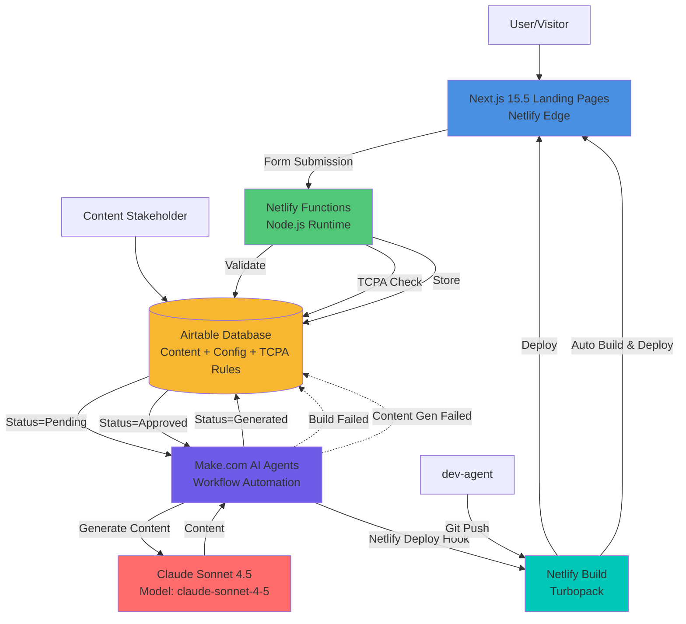

# High Level Architecture

## Technical Summary

The **Landing Pages Automation** system is a **Jamstack serverless architecture** that automates the creation, deployment, and management of marketing landing pages through AI-driven content generation and low-code workflow orchestration.

**Frontend**: Next.js 15.5 (App Router) with TypeScript, deployed to Netlify, provides the landing page templates with server-side rendering for SEO optimization and multi-step form submission handling.

**Backend**: Netlify serverless functions (Node.js 20 runtime) handle form submissions, TCPA compliance validation, reCAPTCHA v3 verification, and webhook integrations with Make.com workflow automation platform.

**Data Layer**: Airtable serves as the primary database, storing landing page configurations, content templates, form submissions, and approval workflows—enabling non-technical stakeholders to manage content through familiar spreadsheet interfaces.

**Integration Layer**: Make.com orchestrates workflows between Airtable (content source), Claude API (AI content generation), and Netlify (deployment triggers via deploy hooks), creating a fully automated pipeline from content brief to deployed landing page.

**Development Approach**: Monorepo structure using npm workspaces enables shared TypeScript types between frontend and serverless functions, with dev-agent as the sole development agent consuming MCP integration guides and this architecture as context.

This architecture achieves the PRD's goal of eliminating human coordination overhead by providing dev-agent with complete implementation guidance, leveraging existing BMad framework patterns rather than creating specialized agents.

## Platform and Infrastructure Choice

**Platform**: **Netlify + Airtable + Make.com**

**Key Services**:
- **Netlify**: Hosting, serverless functions, deployment automation, form handling
- **Airtable**: Database, content management, approval workflows
- **Make.com**: Workflow automation and orchestration (3,000+ integrations, AI Agents)
- **Claude API**: AI content generation (Sonnet 4.5)
- **GitHub**: Version control and deployment triggers

**Deployment Host and Regions**:
- Netlify Global Edge Network (automatic CDN distribution)
- Primary region: US-East (configurable per landing page target audience)

## Repository Structure

**Structure**: Monorepo (single repository with multiple packages)

**Monorepo Tool**: npm workspaces (lightweight, no additional tooling needed)

**Package Organization**:
```
apps/
  web/          # Next.js frontend application
  functions/    # Netlify serverless functions
packages/
  shared/       # Shared TypeScript types and utilities
  config/       # Shared configuration (ESLint, TypeScript, etc.)
```

**Rationale**: Monorepo enables type sharing between frontend and serverless functions (critical for form schemas, Airtable models), while npm workspaces provides sufficient capability without Turborepo/Nx complexity for this project size.

## High Level Architecture Diagram



## Architectural Patterns

- **Jamstack Architecture**: Static site generation with serverless APIs for dynamic functionality - _Rationale: Optimal performance, SEO, and scalability for content-focused landing pages_

- **Headless CMS Pattern**: Airtable as content source, Next.js as presentation layer - _Rationale: Non-technical content management with developer-friendly build integration_

- **Serverless Functions**: Event-driven compute for form processing and webhooks - _Rationale: Zero maintenance, automatic scaling, pay-per-use cost model_

- **API Gateway Pattern**: Netlify Functions as single entry point for all backend logic - _Rationale: Built-in rate limiting, HTTPS, and edge distribution_

- **Workflow Orchestration**: Make.com coordinates multi-step automation flows - _Rationale: Visual workflow builder enables non-developers to modify automation logic_

- **Git-Driven Deployment**: Code commits trigger automatic builds and deploys - _Rationale: Version control for all changes, rollback capability, preview environments_

- **Shared Types Pattern**: TypeScript interfaces defined once in `packages/shared` - _Rationale: Single source of truth for data structures across frontend and backend_

- **Multi-Step Form Pattern**: Progressive disclosure with client-side state management - _Rationale: Higher conversion rates, better data quality, abandonment analytics_

---
