# Landing Pages Automation UI/UX Specification

**Version**: 1.3
**Date**: 2025-10-07
**Author**: Sally (UX Expert)

---

## Change Log

| Date | Version | Description | Author |
|------|---------|-------------|--------|
| 2025-10-07 | 1.3 | Added Implementation Documents section with links to Component Shopping List, Customization Guide, Build Order, and Playwright Test Scenarios | Sally (UX Expert) |
| 2025-10-07 | 1.2 | Updated Core Web Vitals from FID (First Input Delay) to INP (Interaction to Next Paint) per Google's March 2024 standard change | Sally (UX Expert) |
| 2025-10-07 | 1.1 | Added comprehensive Brand Voice & Content Strategy section with messaging frameworks, CTA guidelines, territory customization, and content quality standards | Sally (UX Expert) |
| 2025-10-07 | 1.0 | Initial UI/UX specification creation | Sally (UX Expert) |

---

## Introduction

This document defines the user experience goals, information architecture, user flows, and visual design specifications for Landing Pages Automation's user interface. It serves as the foundation for visual design and frontend development, ensuring a cohesive and user-centered experience.

**Project Context**: Landing Pages Automation generates high-converting, SEO-optimized landing pages for home services contractors (bathroom remodeling, HVAC, roofing). The system leverages Next.js 15.5 for frontend, Netlify for hosting, and Airtable for content management.

**UI Scope**: This specification focuses on **public-facing landing pages** that homeowners interact with. Stakeholder content management is handled through Airtable's native interface (out of scope for Phase 1).

### Implementation Documents

This specification is accompanied by four implementation guides:

1. **[Component Shopping List](./component-shopping-list.md)** - Exact component sources (DaisyUI, HyperUI, Tailblocks) with URLs and code snippets
2. **[Component Customization Guide](./component-customization-guide.md)** - How to adapt pre-built components to match brand guidelines
3. **[Build Order & Acceptance Criteria](./build-order-and-acceptance-criteria.md)** - Phased implementation plan with clear completion criteria
4. **[Playwright Test Scenarios](./playwright-test-scenarios.md)** - Automated validation tests for spec compliance

**Implementation Path**: Component Shopping List → Customization Guide → Build Order → Playwright Validation

---

## Overall UX Goals & Principles

### Target User Personas

#### Primary Persona: Homeowner Lead

**Demographics:**
- Age: 35-65 years old
- Status: Homeowner
- Income: Middle to upper-middle income
- Digital Literacy: Moderate (lower than SaaS audiences)

**Context:**
- Searching for home services contractor (bathroom remodel, HVAC, roofing, etc.)
- 70%+ traffic from mobile devices (industry benchmark)
- Comparison shopping multiple contractors
- Time-constrained (wants quick quote, not lengthy process)

**Pain Points:**
- Skeptical of online forms (spam/robocall concerns)
- Form abandonment due to length anxiety
- Trust concerns with online contractors
- Mobile form friction (tiny inputs, zoom issues)
- Unclear next steps after submission

**Goals:**
- Get a quote quickly (<90 seconds)
- Feel confident contractor is legitimate
- Minimize form friction
- Understand what happens next

**Behavioral Traits:**
- Scans content, doesn't read deeply
- Influenced by urgency/scarcity messaging
- Needs trust signals to complete forms
- Abandons at first friction point

---

### Usability Goals

**Quantified Targets:**

1. **Form Completion Rate**: >40% start-to-submit conversion
   *(Industry average: 25-30%, Target improvement: +35-45%)*

2. **Mobile-First Efficiency**: Complete form in <90 seconds on mobile device
   *(Current: ~120-150 seconds, Target: 25% reduction)*

3. **Trust Building**: Visible institutional trust signals, TCPA compliance clear but not scary
   *(Target: +10% credibility boost via strategic placement)*

4. **Error Prevention**: Real-time validation feedback, zero submission failures
   *(Target: +5% form UX improvement via progressive validation)*

5. **SEO Performance**: Core Web Vitals targets met
   - **LCP** (Largest Contentful Paint): <2.5s *(Target: <2.0s)*
   - **CLS** (Cumulative Layout Shift): <0.1
   - **INP** (Interaction to Next Paint): <200ms *(Google replaced FID with INP in March 2024)*

6. **Cost Efficiency**: Reduce cost per lead by 20-35%
   *(Via improved conversion rates and lead quality)*

---

### Design Principles

#### 1. **Progressive Disclosure Over Overwhelming Forms**
Break intimidating 8+ field forms into manageable chunks (3-step flow). Each step feels like micro-commitment, building momentum toward completion.

**Why it matters**: Form length anxiety is #1 conversion killer. 3-step design achieves 35-45% completion rate improvement.

#### 2. **Trust Through Transparency**
TCPA compliance visible but not scary. Trust signals strategically placed at decision points. Legitimate business indicators throughout.

**Why it matters**: Home services industry requires higher trust thresholds. Trust signal positioning achieves +10% credibility boost.

#### 3. **Mobile-First Experience**
Touch-friendly targets (54px minimum), thumb-zone optimization, no pinch-to-zoom needed. 16px font prevents iOS zoom.

**Why it matters**: 70%+ mobile traffic. Mobile optimization achieves +20% mobile conversion improvement.

#### 4. **Instant Feedback Loops**
Real-time validation, progress indicators, confirmation messaging. Users always know where they are and what's next.

**Why it matters**: Positive reinforcement reduces abandonment. Real-time validation achieves +5% form UX improvement.

#### 5. **Accessibility as Default**
WCAG 2.1 AA compliance, keyboard navigation, screen reader support, high contrast ratios.

**Why it matters**: Legal compliance, SEO benefits, broader audience reach.

---

## Brand Voice & Content Strategy

### Core Voice Attributes

The landing page content must embody these five core voice characteristics:

1. **Trustworthy**: Established, reliable, proven results
   - Use specific numbers and proof points
   - Reference years of experience, customer count, satisfaction rates
   - Avoid unsubstantiated superlatives

2. **Approachable**: Friendly but professional, not overly casual
   - Conversational tone without slang
   - "You" and "your" throughout
   - Imagine helpful consultant showing friend how to save money

3. **Value-Focused**: Emphasize savings and ROI
   - Lead with benefits, not features
   - Quantify savings wherever possible
   - Clear cost/benefit statements

4. **Action-Oriented**: Clear next steps, urgency without pressure
   - Every section ends with next step
   - Urgent without being pushy or desperate
   - Time-based or quantity-based scarcity

5. **Expert**: Knowledgeable without being condescending
   - Explain technical terms simply
   - Educate while building confidence
   - No jargon without context

---

### Tone by Content Section

| Section | Tone | Example |
|---------|------|---------|
| **Headlines** | Bold, benefit-driven, specific | "Save 40% on Bathroom Remodeling in Boston" |
| **Introduction** | Welcoming, problem-aware, solution-focused | "Looking for affordable bathroom remodeling? We've got exclusive deals..." |
| **Body Content** | Educational, clear, value-highlighting | "Every project includes our signature warranty..." |
| **CTAs** | Urgent, specific, value-reinforcing | "Claim Your 40% Discount Today" |

---

### Writing Standards

**Reading Level:**
- **Target**: 3rd grade (Flesch-Kincaid score)
- **Sentence Length**: Average 12-15 words
- **Paragraph Length**: 2-3 sentences maximum
- **Active Voice**: 90%+ of sentences

**Rationale**: Lower reading level maximizes comprehension across all education levels, improves mobile scanning, and increases conversion rates.

---

### Content Structure Formulas

#### Page Title Formula
```
[Offer] + [Product/Service] + [Territory] | [Brand] Deals
```

**Examples:**
- "Save 40% on Bathroom Remodeling in Boston | HomeServices Deals"
- "Free HVAC Quote in Southeast Region | HomeServices Deals"

#### H1 Headline Formula
```
[Action Verb] + [Benefit] + [Product/Service] + [Urgency]
```

**Examples:**
- "Claim Your Exclusive 40% Discount on Bathroom Remodeling Today"
- "Start Saving on HVAC Services – Limited Time Offer"

#### Introduction Paragraph (4-Sentence Structure)
1. **Problem Statement**: One sentence acknowledging user need
2. **Solution Bridge**: How we solve it
3. **Value Statement**: What they save/gain
4. **Trust Signal**: Why choose us

**Example:**
"Looking for affordable bathroom remodeling that actually delivers quality? We've negotiated exclusive deals that save homeowners like you an average of 40% on premium remodeling services. Join 10,000+ satisfied customers who trust us for home services savings. Your perfect bathroom remodel is just one click away."

---

### Messaging Framework by Offer Type

#### Percentage Discount Offers
- **Lead Message**: "Save [X]% on [Service]"
- **Support Message**: "The same quality you trust, at a fraction of the cost"
- **Urgency Message**: "Limited-time [X]% savings"

#### Dollar Amount Off Offers
- **Lead Message**: "Get $[X] off [Service]"
- **Support Message**: "Instant savings, no strings attached"
- **Urgency Message**: "Save $[X] today only"

#### Free Quote/Consultation Offers
- **Lead Message**: "Get Your Free [Service] Quote"
- **Support Message**: "No obligation, no pressure"
- **Urgency Message**: "Limited free quotes available this week"

---

### Trust Builders (Required)

Every landing page must include **2-3 of these trust signals** prominently:

- "Trusted by [X] homeowners"
- "[X] years serving [territory] homeowners"
- "[X]% customer satisfaction rate"
- "Money-back satisfaction guarantee"
- "Licensed and insured contractors"
- "No hidden fees or surprises"
- "Free project quotes"

**Placement Strategy:**
- Step 1 (ZIP entry): Years of experience, customer count
- Step 2 (Contact details): Satisfaction rate, guarantee
- Step 3 (TCPA consent): Licensed/insured, no hidden fees

---

### Urgency Drivers (Required)

Rotate between these genuine urgency mechanisms:

- "Offer expires [specific date]"
- "Only [X] spots remaining this week"
- "[X] homeowners claimed this deal today"
- "Seasonal pricing ends [date]"
- "Limited contractors available in [territory]"

**Critical Rule**: Only use urgency that is genuine and can be backed up. Never create false scarcity.

---

### CTA Button Text Standards

#### Primary CTAs (Form Steps)
- "Claim Your [X]% Discount" *(Percentage offers)*
- "Get My Free Quote" *(Free quote offers)*
- "Start Saving Now" *(Generic savings)*
- "See My Savings" *(ZIP code entry step)*
- "Get Your Deal" *(Final submission)*

#### Secondary CTAs (Informational)
- "See Pricing Details"
- "Calculate Your Savings"
- "Compare Service Options"
- "Call for Questions: [phone]"

**Guidelines:**
- Use descriptive action words (never "Submit" or "Click here")
- Include value proposition in CTA text
- Mobile CTAs: 54px minimum height, full width
- Desktop CTAs: Side-by-side layout acceptable

---

### Territory-Specific Customization

Each territory should have subtle localization for relevance:

#### Territory Messaging Elements
- **Greeting**: "Serving [territory] homeowners since [year]"
- **Trust Signal**: "Trusted by [X] [territory] families"
- **Local Proof**: "[X] projects completed in [city]"
- **Regional Phone**: Display territory-specific phone number

#### Example Territory Data Structure
```typescript
interface TerritoryMessaging {
  name: string; // "Northeast", "Southeast", etc.
  greeting: string; // "Serving Boston to DC homeowners"
  trustSignal: string; // "Trusted by Northeast families since 2015"
  localProof: string; // "5,000+ projects in Massachusetts"
  phoneNumber: string; // "(617) 555-0100"
}
```

---

### Prohibited Content (Never Use)

#### Absolute Prohibitions
- ❌ Superlatives without proof ("best", "greatest", "#1")
- ❌ Fake urgency or false scarcity
- ❌ Misleading comparisons
- ❌ Competitor bashing or negative comparisons
- ❌ Complex industry jargon without explanation
- ❌ Passive voice constructions
- ❌ Sentences over 20 words
- ❌ Paragraphs over 3 sentences
- ❌ Multiple exclamation points
- ❌ ALL CAPS text (except small UI elements)

#### Marketing Speak to Avoid
- "Click here" → Use descriptive CTAs
- "Submit" → Use action-oriented language
- "Cutting-edge", "Revolutionary", "Game-changing" → Be specific instead
- Generic phrases without substance

---

### Content Quality Checklist

Before publishing any landing page content, verify:

- [ ] Reading level is 3rd grade or below (use readability tool)
- [ ] All claims have specific numbers or proof points
- [ ] CTAs clearly state what happens next (no "Submit")
- [ ] No grammar or spelling errors
- [ ] Territory is correctly referenced throughout
- [ ] Offer details match source data (Airtable)
- [ ] 2-3 trust signals included and prominently placed
- [ ] Urgency is genuine (not false scarcity)
- [ ] Benefits outweigh features at 3:1 ratio minimum
- [ ] Customer problem is addressed in opening paragraph
- [ ] Every section has clear next step or CTA
- [ ] Mobile text is minimum 16px (prevents iOS zoom)

---

### A/B Testing Recommendations

Track these content variables for optimization:

| Variable | Version A | Version B | Metric |
|----------|-----------|-----------|--------|
| **Headline** | Benefit-first | Discount-first | Click-through rate |
| **CTA Text** | "Get Quote" | "Claim Discount" | Form start rate |
| **Urgency** | Date-based | Quantity-based | Form completion |
| **Trust Signal** | Numbers | Logos | Credibility perception |
| **Structure** | Long-form | Condensed | Engagement time |

**Testing Priority**: Start with headline and CTA text variations (highest impact on conversion).

---

## Information Architecture (IA)

### Site Map / Screen Inventory


### Navigation Structure

**Primary Navigation:** None (single-page landing experience, no header/footer nav)

**Secondary Navigation:**
- Sticky mobile CTA (appears after scroll)
- Footer with trust badges (optional, depends on page length)

**Breadcrumb Strategy:** Not applicable (single-page flow)

**User Flow Navigation:**
- Linear progression through form steps (Step 1 → Step 2 → Step 3 → Thank You)
- No backward navigation within form (by design, to maintain momentum)
- Exit intent handled via urgency messaging, not navigation

---

## User Flows

### Primary Flow: Lead Capture via Multi-Step Form

**User Goal:** Get a quote for home service project

**Entry Points:**
- Google Ads (PPC campaigns with offer-specific landing pages)
- Organic search (SEO-optimized pages by service + location)
- Facebook/Instagram ads (social media campaigns)

**Success Criteria:**
- User completes all 3 form steps
- reCAPTCHA v3 score ≥0.5 (spam prevention)
- Form submission stored in Airtable
- User sees confirmation on Thank You page

#### Flow Diagram


#### Edge Cases & Error Handling

**Edge Case 1: Invalid ZIP Code**
- **Trigger**: User enters non-5-digit ZIP or letters
- **Handling**: Real-time validation error message: "Please enter a valid 5-digit ZIP code"
- **UX Impact**: Prevents Step 1 submission until corrected

**Edge Case 2: Duplicate Submission (5-Minute Window)**
- **Trigger**: Same email + phone submitted within 5 minutes
- **Handling**: Backend returns HTTP 429, frontend shows: "You've already submitted a request. We'll contact you soon!"
- **UX Impact**: Prevents spam, maintains user confidence

**Edge Case 3: Low reCAPTCHA Score (<0.5)**
- **Trigger**: Bot-like behavior detected by reCAPTCHA v3
- **Handling**: Silent rejection, form appears to submit but lead marked as spam in Airtable
- **UX Impact**: No user-facing error (avoid bot adaptation)

**Edge Case 4: Network Timeout**
- **Trigger**: Netlify Function takes >10 seconds to respond
- **Handling**: Frontend shows error: "Something went wrong. Please try again or call us at [PHONE]"
- **UX Impact**: Provides fallback contact method

**Edge Case 5: Mobile Keyboard Overlays Form**
- **Trigger**: iOS keyboard covers CTA button
- **Handling**: Adjust viewport height dynamically using `window.visualViewport` API
- **UX Impact**: Ensures CTA always visible while typing

**Edge Case 6: User Exits During Form (Abandonment)**
- **Trigger**: User closes tab or navigates away after starting form
- **Handling**:
  - Step 1 complete: Save ZIP in sessionStorage for recovery
  - Step 2 complete: Optional exit-intent popup with urgency message (Phase 2)
- **UX Impact**: Reduce abandonment via recovery and retargeting

**Edge Case 7: TCPA Checkbox Not Checked**
- **Trigger**: User attempts to submit Step 3 without checking TCPA consent
- **Handling**: Disable submit button until checked, show helper text: "Required for quote"
- **UX Impact**: Clear requirement, prevents submission errors

---

### Secondary Flow: Thank You Page Experience

**User Goal:** Understand what happens next after form submission

**Entry Point:** Redirected from successful form submission

**Success Criteria:**
- User sees confirmation message
- User understands next steps (timeline, contact method)
- User has option to share or bookmark

#### Flow Diagram



```mermaid
graph LR
    Submit[Form Submitted] --> Redirect[Redirect to /thank-you]
    Redirect --> Confirm[Display Confirmation<br/>✓ Quote Request Received]
    Confirm --> NextSteps[Show Next Steps<br/>• Call within 24 hours<br/>• Email confirmation sent]
    NextSteps --> Optional[Optional Actions<br/>• Social share<br/>• Add to calendar]

    style Confirm fill:#50C878
```

**Notes:**
- Static page (no dynamic content, no personalization in Phase 1)
- No "Thank You" form (by design, to prevent duplicate submissions)
- Optional: Add social sharing ("Tell your neighbors about this deal")

---

## Wireframes & Mockups

### Design Files

**Primary Design Files:** To be created in Figma (recommended) or similar tool

**Figma Workspace Structure:**
```
Landing-Pages-Automation/
├── 01-Mobile-First-Designs/
│   ├── Hero-Mobile
│   ├── Form-Step1-Mobile
│   ├── Form-Step2-Mobile
│   ├── Form-Step3-Mobile
│   └── ThankYou-Mobile
├── 02-Desktop-Designs/
│   ├── Hero-Desktop
│   ├── Form-Desktop
│   └── ThankYou-Desktop
├── 03-Components/
│   ├── Buttons-CTA
│   ├── Form-Inputs
│   ├── Trust-Badges
│   └── Progress-Indicators
└── 04-Style-Guide/
    ├── Colors
    ├── Typography
    └── Spacing
```

### Key Screen Layouts

#### Screen: Landing Page Hero (Mobile-First)

**Purpose:** Capture attention, communicate offer value, initiate form flow

**Key Elements:**
1. **Hero Image** (full-width, 60vh height)
   - Context-aware selection based on offer value (luxury vs. value)
   - WebP format with fallback
   - Alt text for SEO

2. **Offer Badge** (overlay on hero)
   - Savings amount (e.g., "$3,000 OFF")
   - Qualifying text (e.g., "Full Bathroom Remodels")
   - Gradient background (orange → red for urgency)

3. **Main Headline** (H1, below hero)
   - Benefit-focused (not feature-focused)
   - Follow H1 Headline Formula from Brand Voice section
   - Example: "Claim Your Exclusive 40% Discount on Bathroom Remodeling Today"
   - Territory-aware: "[Action] + [Benefit] + [Service] in [Territory]"

4. **Trust Bar** (immediately below headline)
   - 3 compact trust indicators (territory-customized):
     - 🛡️ Licensed & Insured in [Territory]
     - ⭐ 4.9/5 Rating ([X] [Territory] homeowners)
     - ✅ Free Consultation
   - See Brand Voice section for Trust Builders requirements

5. **Form Step 1** (ZIP entry)
   - Single input field + CTA button
   - Trust copy below: "🔒 Instant Quote • 📞 No Sales Calls • ⏱️ 2-Minute Process"

**Interaction Notes:**
- Hero image uses `loading="eager"` for LCP optimization
- CTA button has `:active` state for touch feedback
- Scroll position triggers sticky mobile CTA after 300px

**Design File Reference:** `01-Mobile-First-Designs/Hero-Mobile.fig`

---

#### Screen: Form Step 2 - Contact Details (Mobile)

**Purpose:** Collect lead information with momentum from Step 1 completion

**Key Elements:**
1. **Progress Indicator** (top of form)
   - Visual: 2 of 3 steps complete
   - Shows user they're halfway through

2. **Personalized Headline** (dynamic)
   - Example: "Your $3,000 Bathroom Remodel Savings for [60614]"
   - Reinforces offer value + user's ZIP

3. **Urgency Timer** (below headline)
   - "⏰ Hold expires in: 14:59" (15-minute countdown)
   - Creates scarcity without aggressive pressure

4. **Form Grid** (2-column on mobile for name fields)
   - First Name (required)
   - Last Name (required)
   - Email Address (required, validated)
   - Phone Number (required, 10 digits, US format)
   - Project Type (dropdown, options from Airtable)
   - How Did You Hear (dropdown)
   - Comments (optional textarea)

5. **Real-Time Validation**
   - Green checkmark (✓) on valid field blur
   - Red border + error message on invalid

6. **CTA Button**
   - Text: "Lock In My $3,000 Savings" (dynamic based on offer)
   - Full width on mobile
   - 54px min-height for thumb target

**Interaction Notes:**
- Field progression: Name → Email → Phone → Project → Submit
- Auto-advance to next field on Enter key (except textarea)
- Form state saved to sessionStorage on blur (recovery)

**Design File Reference:** `01-Mobile-First-Designs/Form-Step2-Mobile.fig`

---

#### Screen: Form Step 3 - TCPA Consent (Mobile)

**Purpose:** Obtain legal consent while maintaining conversion momentum

**Key Elements:**
1. **Progress Indicator** (3 of 3)

2. **TCPA Consent Checkbox** (large, easy to tap)
   - ☐ "I agree to receive calls/texts about my project at the number provided. Standard rates may apply."
   - Helper link: "Read our Privacy Policy" (opens modal)

3. **Submit Button** (disabled until checkbox checked)
   - Text: "Get My Free Quote" (final CTA)
   - 54px min-height, full width

4. **reCAPTCHA Badge** (bottom-right corner)
   - Google reCAPTCHA v3 badge (required by Google)
   - "This site is protected by reCAPTCHA"

5. **Trust Reinforcement** (below form)
   - "🔒 Your information is secure and will not be shared."

**Interaction Notes:**
- Checkbox must be checked to enable submit button
- reCAPTCHA v3 executes invisibly on submit click
- Submit shows loading spinner for 1-2 seconds during processing

**Design File Reference:** `01-Mobile-First-Designs/Form-Step3-Mobile.fig`

---

#### Screen: Thank You Page (Mobile)

**Purpose:** Confirm submission, set expectations, reduce anxiety

**Key Elements:**
1. **Success Icon** (large checkmark, green)

2. **Confirmation Headline**
   - "✓ Quote Request Received!"

3. **Next Steps** (numbered list)
   - "1. We'll call you within 24 hours"
   - "2. Check your email for confirmation"
   - "3. A local expert will discuss your project"

4. **Contact Fallback** (in case user prefers to call)
   - "Prefer to speak now? Call us at [PHONE NUMBER]"

5. **Social Sharing** (optional)
   - "Know someone else who needs this? Share the savings!"
   - Share buttons: Facebook, Twitter, Email

**Interaction Notes:**
- Static page, no form (prevents duplicate submissions)
- Auto-redirect after 30 seconds to main website (optional, Phase 2)

**Design File Reference:** `01-Mobile-First-Designs/ThankYou-Mobile.fig`

---

## Component Library / Design System

### Design System Approach

**Decision:** Create custom component library using Radix UI primitives + Tailwind CSS

**Rationale:**
- Radix UI provides accessible, unstyled components (WCAG 2.1 AA compliant)
- Tailwind CSS enables rapid iteration and consistent design tokens
- No pre-built design system (e.g., Material-UI) needed for simple landing pages
- Components optimized for conversion (not general-purpose)

**Component Storage:**
- Location: `/apps/web/components/`
- Naming: PascalCase (e.g., `FormField.tsx`, `CTAButton.tsx`)
- Storybook: Not required for Phase 1 (simple component set)

---

### Core Components

#### Component: CTAButton

**Purpose:** Primary call-to-action button with conversion optimization

**Variants:**
- `primary`: Blue background, white text (default)
- `secondary`: White background, blue border (rare, for non-primary actions)
- `disabled`: Gray background, cursor not-allowed

**States:**
- `default`: Normal state
- `hover`: Slight lift effect (translateY -2px), shadow
- `active`: Pressed state (translateY 0px)
- `disabled`: Non-interactive, reduced opacity
- `loading`: Spinner icon, text "Processing..."

**Props:**
```typescript
interface CTAButtonProps {
  variant?: 'primary' | 'secondary';
  size?: 'sm' | 'md' | 'lg';
  fullWidth?: boolean;
  loading?: boolean;
  disabled?: boolean;
  children: React.ReactNode;
  onClick?: () => void;
}
```

**Usage Guidelines:**
- Always use `primary` variant for form submissions
- Include descriptive text (not just "Submit" - see Brand Voice section)
- Follow CTA Button Text Standards (see Brand Voice & Content Strategy)
- Example: "Claim Your 40% Discount" or "Get My Free Quote" (dynamic based on offer type)
- Mobile: Always `fullWidth={true}`
- Text must communicate value proposition (discount amount, benefit, urgency)

---

#### Component: FormField

**Purpose:** Reusable input field with validation feedback

**Variants:**
- `text`: Single-line text input
- `email`: Email input with validation
- `tel`: Phone number input (formatted as 10 digits)
- `select`: Dropdown selection
- `textarea`: Multi-line text

**States:**
- `default`: Empty, ready for input
- `focus`: Active input, blue border
- `valid`: Green border, checkmark icon
- `invalid`: Red border, error message below
- `disabled`: Gray background, non-interactive

**Props:**
```typescript
interface FormFieldProps {
  type: 'text' | 'email' | 'tel' | 'select' | 'textarea';
  name: string;
  label?: string;
  placeholder: string;
  required?: boolean;
  error?: string;
  value: string;
  onChange: (value: string) => void;
  onBlur?: () => void;
}
```

**Usage Guidelines:**
- Always provide `placeholder` text (not just label)
- Show validation feedback on `blur`, not `onChange` (reduces friction)
- Error messages below field, red text, 0.875rem font size
- Success checkmark (✓) appears to right of field on valid

---

#### Component: ProgressBar

**Purpose:** Visual indicator of multi-step form progress

**Variants:**
- `linear`: Horizontal bar (mobile)
- `steps`: Numbered circles (desktop)

**States:**
- `Step 1 active`: First circle filled, others outlined
- `Step 2 active`: First two circles filled
- `Step 3 active`: All three circles filled

**Props:**
```typescript
interface ProgressBarProps {
  currentStep: 1 | 2 | 3;
  totalSteps: 3;
  variant?: 'linear' | 'steps';
}
```

**Usage Guidelines:**
- Always show progress between form steps
- Update immediately on step transition (no delay)
- Mobile: Use `linear` variant (saves vertical space)
- Desktop: Use `steps` variant (more visual clarity)

---

#### Component: TrustBadge

**Purpose:** Display trust signals (licenses, ratings, guarantees)

**Variants:**
- `icon-text`: Icon + text (e.g., "🛡️ Licensed & Insured")
- `image-text`: Logo image + text (e.g., BBB logo + "A+ Rating")

**Props:**
```typescript
interface TrustBadgeProps {
  icon?: string; // Emoji or icon name
  image?: string; // Path to logo image
  text: string;
  variant?: 'icon-text' | 'image-text';
}
```

**Usage Guidelines:**
- Use in header trust bar (3 badges horizontally)
- Use near form (builds confidence at decision point)
- Keep text concise (2-4 words max)
- Examples: "Licensed & Insured", "10-Year Warranty", "BBB A+ Rating"

---

## Branding & Style Guide

### Visual Identity

**Brand Guidelines:** To be provided by client (or created if greenfield)

**For Phase 1 (Default Styling):**
- Professional, trustworthy contractor aesthetic
- Blue primary (trust/reliability), orange accent (urgency/savings)
- Clean, modern typography (no script fonts)
- High contrast for readability

---

### Color Palette

| Color Type | Hex Code | Usage | Rationale |
|------------|----------|-------|-----------|
| **Primary Blue** | `#1e40af` | CTA buttons, links, brand elements | Trust and reliability (financial/professional) |
| **Primary Blue Light** | `#3b82f6` | Hover states, secondary elements | Lighter variant for interactive feedback |
| **Accent Orange** | `#ea580c` | Savings badges, urgency elements | Creates urgency, draws attention to offers |
| **Accent Orange Light** | `#fb923c` | Hover on urgency elements | Lighter variant for consistency |
| **Success Green** | `#059669` | Form validation success, checkmarks | Positive reinforcement |
| **Error Red** | `#dc2626` | Form validation errors, warnings | Clear error communication |
| **Warning Red** | `#dc2626` | Countdown timers, scarcity | Urgency without alarm |
| **Neutral Gray 50** | `#f8fafc` | Backgrounds, subtle elements | Clean, modern feel |
| **Neutral Gray 900** | `#0f172a` | Body text, headings | High contrast for readability |

**Color Psychology Notes:**
- **Blue**: Most trusted color for financial/professional services
- **Orange/Red**: Urgency and action (use sparingly for savings badges and CTAs)
- **Green**: Universal success indicator
- **Gray**: Professional, doesn't compete with primary colors

---

### Typography

#### Font Families

- **Primary Font**: `Inter` (sans-serif)
  - Clean, modern, excellent readability
  - Variable font for performance
  - Web-safe fallback: `-apple-system, BlinkMacSystemFont, "Segoe UI", sans-serif`

- **Secondary Font**: `Inter` (same family, no need for second font)
  - Maintains consistency, reduces font loading time

- **Monospace Font**: `"Fira Code", Consolas, Monaco, monospace`
  - Used only for numeric displays (countdown timers, if needed)

**Font Loading:**
```html
<!-- Google Fonts with preconnect optimization -->
<link rel="preconnect" href="https://fonts.googleapis.com">
<link rel="preconnect" href="https://fonts.gstatic.com" crossorigin>
<link href="https://fonts.googleapis.com/css2?family=Inter:wght@400;600;700;800&display=swap" rel="stylesheet">
```

#### Type Scale

| Element | Size | Weight | Line Height | Usage |
|---------|------|--------|-------------|-------|
| **H1** | `2.25rem` (36px) | 800 (Extra Bold) | `2.5rem` | Main headline, hero section |
| **H2** | `1.875rem` (30px) | 700 (Bold) | `2.25rem` | Section headings |
| **H3** | `1.5rem` (24px) | 600 (Semi-Bold) | `2rem` | Subsection headings |
| **Body** | `1rem` (16px) | 400 (Regular) | `1.5rem` | Paragraph text, form labels |
| **Small** | `0.875rem` (14px) | 400 (Regular) | `1.25rem` | Helper text, disclaimers |

**Mobile Adjustments:**
- H1: `1.875rem` (30px) on mobile (avoid overwhelming small screens)
- Body: Always `16px` minimum (prevents iOS zoom on input focus)

---

### Iconography

**Icon Library:** Heroicons (MIT license, Tailwind CSS compatible)

**Icon Usage:**
- **Size**: 20px or 24px (consistent throughout)
- **Style**: Outline style (not solid, for modern feel)
- **Color**: Inherit from parent text color

**Common Icons:**
- ✓ Checkmark: Form validation success
- ✗ X mark: Form validation error
- 🔒 Lock: Security/privacy messaging
- ⏰ Clock: Countdown timers
- 📞 Phone: Contact information
- ✉️ Envelope: Email-related

**Trust Badge Icons:**
- Use client-provided logos (BBB, licenses, certifications)
- SVG format for scalability
- Alt text required for accessibility

**Usage Guidelines:**
- Icons enhance, not replace, text labels
- Use sparingly (don't overwhelm with icons)
- Maintain consistent size across components

---

### Spacing & Layout

**Grid System:** 12-column grid (standard, provided by Tailwind CSS)

**Container Widths:**
- **Mobile**: 100% width, 16px padding left/right
- **Tablet**: Max 768px, 24px padding
- **Desktop**: Max 1200px, 32px padding

**Spacing Scale:**
Tailwind CSS default scale (multiples of 0.25rem)

| Size | Rem | Pixels | Usage |
|------|-----|--------|-------|
| `1` | `0.25rem` | 4px | Tight spacing (icon gaps) |
| `2` | `0.5rem` | 8px | Compact spacing |
| `4` | `1rem` | 16px | Standard spacing (between elements) |
| `6` | `1.5rem` | 24px | Section padding |
| `8` | `2rem` | 32px | Large section spacing |
| `12` | `3rem` | 48px | Major section breaks |

**Layout Principles:**
- **Vertical Rhythm**: Consistent spacing between sections (use `8` or `12`)
- **White Space**: Don't fear empty space (improves readability)
- **Mobile-First**: Design for smallest screen, scale up

---

## Accessibility Requirements

### Compliance Target

**Standard:** WCAG 2.1 Level AA

**Rationale:**
- Legal requirement (ADA compliance for US-based businesses)
- SEO benefits (Google favors accessible sites)
- Broader audience reach (aging demographic, visual impairments)
- Level AA is industry standard (Level AAA often impractical)

---

### Key Requirements

#### Visual

**Color Contrast Ratios:**
- **Normal Text (16px+)**: Minimum 4.5:1 contrast ratio
  - Example: `#0f172a` (gray-900) text on `#f8fafc` (gray-50) background = 15.5:1 ✓
- **Large Text (24px+)**: Minimum 3:1 contrast ratio
- **UI Components**: Minimum 3:1 contrast ratio (buttons, form borders)

**Validation:**
- Use WebAIM Contrast Checker: https://webaim.org/resources/contrastchecker/
- Test all text/background combinations before implementation

**Focus Indicators:**
- Visible focus ring on all interactive elements (buttons, inputs, links)
- Blue outline: `outline: 2px solid #3b82f6; outline-offset: 2px;`
- Never `outline: none` without custom focus style

**Text Sizing:**
- All text resizable up to 200% without loss of functionality
- Use `rem` units (not `px`) for font sizes
- No fixed-height containers that clip text on zoom

---

#### Interaction

**Keyboard Navigation:**
- All interactive elements accessible via `Tab` key
- Skip to main content link (for screen readers)
- Form submission via `Enter` key
- No keyboard traps (user can always navigate away)

**Tab Order:**
- Logical sequence (hero → form → trust signals → testimonials)
- Matches visual layout (don't jump around page)

**Screen Reader Support:**
- Semantic HTML (`<header>`, `<main>`, `<nav>`, `<form>`)
- `aria-label` for icon-only buttons
- `aria-describedby` for form error messages
- `aria-live` regions for dynamic content (countdown timers, validation)

**Touch Targets:**
- Minimum 44x44px (iOS Human Interface Guidelines)
- Prefer 54px for primary actions (improved usability)
- Adequate spacing between tappable elements (8px minimum)

---

#### Content

**Alternative Text:**
- All images have `alt` attribute
- Decorative images: `alt=""` (empty, screen reader skips)
- Meaningful images: Descriptive alt text
  - Example: `alt="Modern bathroom remodel with walk-in shower and marble countertops"`

**Heading Structure:**
- Logical hierarchy: H1 → H2 → H3 (no skipping levels)
- Only one H1 per page (main headline)
- Headings describe content below them

**Form Labels:**
- Every input has associated `<label>` element
- Label text visible (not just placeholder)
- Error messages linked via `aria-describedby`

---

### Testing Strategy

**Automated Testing:**
- **Tool**: Lighthouse Accessibility audit (Chrome DevTools)
- **Frequency**: Every build (CI/CD pipeline)
- **Target**: 100% score (or justify deviations)

**Manual Testing:**
- **Keyboard Navigation**: Tab through entire page without mouse
- **Screen Reader**: Test with NVDA (Windows) or VoiceOver (Mac)
- **Color Blindness**: Use Chrome Color Vision Deficiency emulator
- **Zoom**: Test at 200% zoom (ensure no content clipped)

**Testing Checklist:**
- [ ] All interactive elements keyboard accessible
- [ ] Focus indicators visible
- [ ] All images have alt text
- [ ] Form labels associated with inputs
- [ ] Error messages announced by screen readers
- [ ] Color contrast ratios meet WCAG AA
- [ ] Text resizable to 200% without breaking layout

---

## Responsiveness Strategy

### Breakpoints

| Breakpoint | Min Width | Max Width | Target Devices | Design Notes |
|------------|-----------|-----------|----------------|--------------|
| **Mobile** | `0px` | `767px` | Smartphones (iPhone, Android) | Single column, stacked layout, full-width CTAs |
| **Tablet** | `768px` | `1023px` | iPad, Android tablets | 2-column form grid, larger hero images |
| **Desktop** | `1024px` | `1439px` | Laptops, small monitors | Side-by-side form + social proof, max 1200px container |
| **Wide** | `1440px` | - | Large monitors, 4K displays | Same as desktop (don't stretch past 1200px) |

**Rationale:**
- 70%+ traffic from mobile (prioritize mobile-first design)
- Tablet breakpoint aligns with iPad (768px = portrait mode)
- Desktop breakpoint at 1024px (common laptop resolution)
- Wide screens use same desktop layout (avoid excessive whitespace)

---

### Adaptation Patterns

#### Layout Changes

**Mobile → Tablet:**
- Form fields: Single column → 2-column grid (first name / last name side-by-side)
- Hero image: 60vh height → 70vh height
- Trust bar: Stacked vertically → Horizontal row

**Tablet → Desktop:**
- Form: Centered (600px max-width) → Side-by-side with social proof sidebar
- Hero: Full-width → 2-column (content left, image right)
- Typography: No change (already optimized at tablet)

---

#### Navigation Changes

**Mobile:**
- No header navigation (single-page flow)
- Sticky CTA button appears after 300px scroll (bottom of screen)
- Text: "Get My Quote" (short for small screens)

**Desktop:**
- No sticky CTA (form always visible above fold)
- Standard header with logo + trust badges (optional, Phase 2)

---

#### Content Priority

**Mobile-First Prioritization:**
1. **Hero offer** (savings amount, main headline)
2. **Form Step 1** (ZIP entry)
3. **Trust signals** (3 compact badges)
4. **Social proof** (recent activity widget)
5. **Testimonials** (1-2 visible, rest collapsed)

**Desktop Enhancements:**
- All testimonials visible (no collapse)
- Social proof sidebar (persistent while scrolling)
- Larger hero image (more visual impact)

---

#### Interaction Changes

**Mobile:**
- Touch-optimized (54px min-height on buttons)
- Swipe gestures disabled (prevent accidental navigation)
- iOS keyboard: Adjust viewport height to prevent CTA occlusion

**Desktop:**
- Hover states enabled (lift effect on buttons, image zoom)
- Cursor changes to pointer on interactive elements
- No touch feedback needed

---

## Animation & Micro-interactions

### Motion Principles

1. **Purposeful Motion**: Animations guide attention, don't distract
2. **Performance-First**: No animations that impact LCP or CLS
3. **Reduced Motion**: Respect `prefers-reduced-motion` setting
4. **Subtle > Flashy**: Smooth transitions, not jarring movements

**Animation Budget:**
- Page load: Hero fade-in only (0.3s)
- Form interactions: Validation feedback (0.2s)
- Button states: Hover/active transitions (0.15s)
- No auto-playing carousels or slideshows (accessibility concern)

---

### Key Animations

**Animation 1: Form Validation Success**
- **Trigger**: User blurs valid input field
- **Effect**: Green checkmark (✓) fades in to right of field
- **Duration**: 200ms
- **Easing**: `ease-in-out`

**Animation 2: CTA Button Hover (Desktop Only)**
- **Trigger**: Mouse hover over button
- **Effect**: Button lifts 2px up, shadow increases
- **Duration**: 150ms
- **Easing**: `ease-out`

**Animation 3: Error Message Slide-In**
- **Trigger**: Invalid form submission attempt
- **Effect**: Error message slides down below field
- **Duration**: 200ms
- **Easing**: `ease-in-out`

**Animation 4: Step Transition**
- **Trigger**: User completes form step, moves to next
- **Effect**: Current step fades out (200ms), next step fades in (200ms)
- **Duration**: 400ms total (sequential)
- **Easing**: `ease-in-out`

**Animation 5: Countdown Timer**
- **Trigger**: Page load (if countdown enabled)
- **Effect**: Seconds decrement every 1000ms, no visual animation
- **Duration**: N/A (functional, not decorative)

**Animation 6: Loading Spinner (Form Submission)**
- **Trigger**: User clicks submit button
- **Effect**: Button text changes to "Processing...", spinner icon rotates
- **Duration**: 1-2 seconds (until server responds)
- **Easing**: Linear rotation

---

## Performance Considerations

### Performance Goals

| Metric | Target | Rationale |
|--------|--------|-----------|
| **Page Load Time** | <2.0s (3G network) | Fast loads reduce bounce rate |
| **Time to Interactive** | <2.5s | Users can interact quickly |
| **Largest Contentful Paint (LCP)** | <2.0s | Core Web Vital (SEO ranking factor) |
| **Interaction to Next Paint (INP)** | <200ms | Core Web Vital for responsiveness (replaced FID in 2024) |
| **Cumulative Layout Shift (CLS)** | <0.1 | No layout jumps (UX + SEO) |

---

### Design Strategies

**Image Optimization:**
- Use Next.js `<Image>` component (automatic WebP conversion)
- Hero images: Preload with `priority` prop
- Responsive images: `srcset` for 400w, 800w, 1200w
- Lazy load below-the-fold images

**Critical CSS:**
- Inline critical CSS for hero and form (above fold)
- Defer non-critical CSS (testimonials, footer)

**Font Loading:**
- Preconnect to Google Fonts: `<link rel="preconnect" href="https://fonts.googleapis.com">`
- Use `font-display: swap` (fallback font while loading)

**Third-Party Scripts:**
- Load Google Tag Manager asynchronously
- reCAPTCHA v3: Load on form interaction (not page load)
- Defer non-essential scripts (chat widgets, if added)

**Progressive Enhancement:**
- Core functionality works without JavaScript
- Form submission: Use standard HTML form action as fallback
- Countdown timer: Optional, doesn't block submission

---

## Next Steps

### Immediate Actions

1. **Review with Stakeholders** (1-2 days)
   - Present UX goals and design principles
   - Validate user personas with client
   - Confirm color palette and branding

2. **Create Visual Designs** (3-5 days)
   - Design hero section variants in Figma
   - Create mobile-first wireframes for all 3 form steps
   - Design component library (buttons, inputs, trust badges)

3. **Prepare for Frontend Architecture Handoff** (1 day)
   - Export design tokens (colors, typography, spacing) as CSS variables
   - Provide Figma design files to dev-agent
   - Create component specifications for Radix UI + Tailwind implementation

4. **Note Open Questions:**
   - Client brand guidelines: Do they exist? If not, who creates them?
   - Trust badge assets: Does client have BBB logo, license certificates?
   - Countdown timer: Real-time via API or static JavaScript calculation?
   - Hero images: Stock photos or custom photoshoots?

---

### Design Handoff Checklist

- [ ] All user flows documented (primary + secondary)
- [ ] Component inventory complete (buttons, inputs, progress bars, trust badges)
- [ ] Accessibility requirements defined (WCAG 2.1 AA)
- [ ] Responsive strategy clear (mobile-first, 4 breakpoints)
- [ ] Brand guidelines incorporated (colors, typography, logos)
- [ ] Performance goals established (LCP <2.0s, CLS <0.1)
- [ ] Visual designs created in Figma (or design tool)
- [ ] Design tokens exported as CSS variables
- [ ] Conversion optimization principles documented (2-step form, trust signals, urgency)

---

**Document Status:** COMPLETE (Draft for Stakeholder Review)
**Version:** 1.0
**Next Review:** After stakeholder feedback and Figma designs

---
